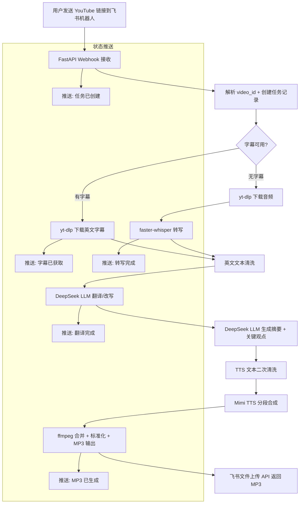

## Goal Capsule

- **Objective:** 构建一个个人工具，用户在手机上通过飞书机器人分享 YouTube 英文播客链接，系统自动转换为自然流畅的中文 MP3 并返回。部署于用户的云服务器，仅供个人学习使用。
- **Product authority:** 用户自托管，单人使用。
- **Open blockers:** 无。

---

## Product Contract

### Summary

一个通过飞书机器人驱动的英文 YouTube 播客转中文 MP3 个人工具。用户分享链接 → 选择输出模式（默认播客化改写）→ 系统分段处理并推送进度 → 最终返回自然流畅的中文 MP3。三种输出模式覆盖不同收听场景：忠实翻译、播客化改写、精华浓缩。部署在云服务器上，飞书回调直连。频道自动订阅和私有 RSS 播客源作为第二阶段。

### Problem Frame

英文 YouTube 播客内容质量高（深度访谈、行业观点、前沿讨论），但中文用户面临双重门槛：英文听力负担重，长时间收听成本高。手动下载视频、提取字幕、翻译校对、合成语音的过程繁琐重复，无法形成长期收听习惯。本工具面向已经知道想看什么内容的用户——用户在 YouTube 上发现感兴趣的播客后，只需分享链接即可获得中文 MP3，把"有链接"到"能收听"压缩为一步。内容发现能力（频道推荐、热门内容）不在 MVP 范围内，留待第二阶段通过频道订阅功能支撑。

### Requirements

**飞书交互**

- R1. 用户通过飞书机器人发送 YouTube 视频链接，系统识别并创建处理任务。
- R2. 处理过程中，系统向用户推送阶段性进度更新（字幕获取、转写、翻译、语音合成等关键节点）。
- R3. 处理完成后，系统通过飞书返回中文 MP3 音频文件。

**模式选择**

- R4. 系统支持三种输出模式：忠实翻译版（保留原文结构和完整内容）、中文播客版（自然中文播客表达重写）、精华浓缩版（压缩至 20–30 分钟关键内容）。
- R5. 用户未指定模式时，默认使用中文播客版。

**视频处理**

- R6. 从 YouTube URL 提取视频元数据（标题、频道、时长、发布日期）。
- R7. 优先使用视频已有英文字幕；无字幕时回退到音频转写。
- R8. 清洗英文文本：去除语气词、重复寒暄、广告段落，合并过短句子。
- R9. MVP 阶段支持处理 30–90 分钟的英文播客视频。

**内容转换**

- R10. 将英文内容翻译为中文，保留原文核心观点、事实和逻辑。不添加原文没有的事实性内容（观点、数据、论断）；模式特定的语言性改写（过渡语、口语化衔接、语境铺垫）不受此限。
- R11. 中文播客版模式下，将内容改写为适合中文听众收听的播客稿——语言自然、句子不过长、适合 TTS 朗读。
- R12. 精华浓缩版模式下，提取最重要的观点和论证，压缩至 20–30 分钟中文音频稿。
- R13. 忠实翻译版模式下，尽量保留原文结构和完整内容。
- R14. 每期节目生成中文标题、150 字以内节目摘要和不少于 5 条关键观点。

**音频合成**

- R15. 将中文播客稿合成为 MP3 音频，使用单一中文音色。
- R16. TTS 合成前对中文稿进行二次清洗：去除 Markdown 标记和 URL，处理英文名、数字、缩写使朗读自然，控制句子长度。
- R17. 合并多段音频为单个 MP3，标准化音量，确保无明显断裂。单集输出音频建议不超过 60 分钟；超出部分自动拆分为多集（Part 1 / Part 2），便于分段收听。

**处理可靠性**

- R18. 每个处理阶段完成后保存中间结果，支持从失败阶段继续执行。
- R19. 网络请求、API 调用、TTS 合成失败时自动重试。
- R20. 检测重复视频提交，已处理视频不重复消耗 API 成本，除非用户明确要求重新生成。

**部署方式**

- R21. 系统部署在用户的云服务器上，通过公网 IP 接收飞书机器人回调。

### Key Decisions

- **飞书机器人作为交互层。** 用户日常使用飞书，在手机上分享链接是最自然的操作。飞书机器人充当交互入口，省去 Web 前端开发。飞书 bot API 对个人工具部署门槛低于微信服务号等替代方案。进度推送和文件返回均在飞书会话内完成。
- **云服务器部署而非本地。** 云服务器有公网 IP，飞书 webhook 回调直连可达，不需要额外搭建穿透隧道。文件可后续同步到本地。
- **单音色先行，多说话人后补。** 说话人识别 + 多音色编排显著增加 MVP 复杂度。先用单一音色验证核心翻译→合成链路，链路稳定后再扩展多角色声音。
- **三种输出模式覆盖不同场景。** 忠实翻译满足深度学习和研究，播客化改写适合日常收听，精华浓缩适配碎片时间。三种模式共享同一处理管道，差异在翻译阶段的 prompt 策略。MVP 以中文播客版的输出质量为验收锚点；忠实翻译版和精华浓缩版允许较低的质量容忍度，后续迭代中逐步调优。精华浓缩版涉及内容选取和结构重组，质量风险高于其他两种模式——若首轮单 prompt 浓缩效果不佳，考虑切换为多步管道（先选段→再翻译）。

### Key Flows

- F1. 主处理流程
  - **Trigger:** 用户通过飞书机器人发送 YouTube 链接
  - **Steps:**
    1. 系统解析链接，提取视频元数据，创建任务
    2. 用户选择输出模式（未选择则默认中文播客版）
    3. 获取英文字幕；无字幕时下载音频并转写
    4. 清洗英文文本
    5. 按选定模式翻译/改写为中文播客稿
    6. 生成节目摘要和关键观点
    7. 中文稿 TTS 合成为 MP3 片段，合并为完整音频
    8. 通过飞书返回 MP3 文件
  - **进度推送:** 步骤 3–7 的每个阶段完成后向用户推送状态更新
  - **失败处理:** 任意步骤失败后重试，重试从上次成功的阶段继续

- F2. 模式选择流程
  - **Trigger:** 用户发送链接，系统立即按默认模式（中文播客版）开始处理
  - **Steps:**
    1. 用户可通过链接前缀指定模式（如 `浓缩 https://...`、`忠实 https://...`）
    2. 未指定前缀时使用默认模式（中文播客版）
    3. 系统在第一条进度推送中告知当前使用的模式
    4. MVP 不支持处理中途切换模式——模式在提交时确定
  - **默认行为:** 用户直接发送链接，无前缀 → 中文播客版。模式信息随第一条进度推送送达。

### Scope Boundaries

**后续阶段（MVP 之后）：**

- 频道自动扫描：配置关注频道后定时检测新视频并自动加入处理队列
- 私有 RSS 播客源：生成私有 RSS 地址，用户可在手机播客 App 中订阅收听
- 多说话人声音区分：识别不同说话人并分配不同 TTS 音色

**明确不做（除非需求变化）：**

- Web 管理后台 —— 飞书机器人已覆盖核心交互
- 知识库搜索和 RAG 问答 —— 原 PRD 第六阶段，当前没有明确需求
- 公开播客发布或商业化分发 —— 仅用于个人学习和私有收听
- 多用户系统

### Acceptance Examples

- AE1. 有字幕的播客处理
  - **Covers R6, R7, R11, R14.**
  - **Given** 用户发送一个有英文字幕的 60 分钟英文访谈 YouTube 链接
  - **When** 用户选择中文播客版模式
  - **Then** 系统提取字幕 → 清洗 → 翻译改写 → 生成摘要和关键观点 → TTS 合成 → 返回中文 MP3。整个过程用户收到阶段性进度推送。

- AE2. 无字幕的播客处理（回退到转写）
  - **Covers R7.**
  - **Given** 用户发送一个无字幕的英文播客 YouTube 链接
  - **When** 系统检测无可用字幕
  - **Then** 系统下载音频 → 分段转写 → 合并转写结果 → 进入正常的翻译和合成流程。

- AE3. 处理中途失败后恢复
  - **Covers R18, R19.**
  - **Given** 一个任务在翻译阶段因 API 调用超时失败
  - **When** 用户触发重试
  - **Then** 系统从翻译阶段继续，复用已保存的字幕提取和文本清洗结果，不重新执行已完成步骤。

- AE4. 重复提交同一视频
  - **Covers R20（跳过路径）.**
  - **Given** 用户发送一个之前已成功处理过的 YouTube 链接
  - **When** 系统检测到重复
  - **Then** 系统跳过处理，直接返回已有的中文 MP3，不消耗额外 API 成本。

- AE4b. 重复提交但明确要求重新生成
  - **Covers R20（重新生成路径）.**
  - **Given** 用户发送一个之前已成功处理过的 YouTube 链接，并明确指示重新生成
  - **When** 系统检测到重复但用户要求覆盖
  - **Then** 系统重新执行完整处理流程，覆盖之前保存的中间结果和最终 MP3。

### Dependencies / Assumptions

- 用户拥有可用的云服务器，具备公网 IP 和足够的存储空间
- 飞书应用已创建并获得机器人相关权限
- 翻译质量依赖所选用 LLM 的能力。MVP 验收前需用至少一个真实播客做端到端主观听感验证：能否不费力地跟随论述听完。若不达标，需迭代 prompt 或换模型。
- YouTube 字幕可用性取决于原视频，部分视频可能无字幕且音频转写质量受限
- 系统仅用于个人学习，不上传或发布生成内容到公开平台

### Outstanding Questions

**Deferred to Planning:**

- 单集处理的 API 成本上限（预估数量级：单集约 ¥1–3）？会影响缓存策略和模型选型。此数量级下 R20 的文件系统级缓存足够。

**Product Contract preservation:** 未更改。

---

## Planning Contract

### Key Technical Decisions

- **KTD1. Python 全栈。** 整个系统使用 Python 实现——yt-dlp 是 Python 生态中最成熟的 YouTube 下载工具，faster-whisper 的 Python 绑定最完善，LLM API 调用链（openai 兼容 SDK）和飞书 SDK 也均有 Python 一等支持。单一语言降低部署和调试复杂度。
- **KTD2. DeepSeek 作为 LLM 翻译引擎。** 通过 OpenAI 兼容 API 调用 DeepSeek Chat，翻译质量和成本平衡良好。API 抽象层使用 `openai` Python SDK 指向 DeepSeek endpoint，方便后续切换到其他兼容 provider。
- **KTD3. Mimi TTS 作为语音合成引擎。** 用户指定 Mimi TTS 模型进行中文语音合成。TTS 调用封装为独立模块，可替换为其他引擎。
- **KTD4. SQLite 作为任务状态存储。** 单用户、低并发场景下 SQLite 足够，无需 PostgreSQL 的运维负担。文件系统存储中间产物（字幕文本、转写文本、中文稿、TTS 片段、最终 MP3），数据库记录任务状态和文件路径。
- **KTD5. Webhook 异步分发，管道同步执行。** FastAPI 接收飞书 webhook 后立即返回 200 响应，管道通过后台线程（`threading.Thread`）异步启动。管道内部保持同步顺序执行，进度更新通过飞书 API 主动推送。不引入 Celery/Redis 等外部消息队列——后台线程足以处理单用户场景的并发（同一用户同一时间通常只有一个活跃任务）。
- **KTD6. Prompt 模板独立文件存储。** 三种模式的翻译 prompt 和摘要 prompt 以 `.txt` 文件存放在 `prompts/` 目录下，与代码分离。调优 prompt 不需要改代码或重启服务——每次调用时从文件读取。
- **KTD7. 文件系统中间产物持久化。** 每个处理阶段的输出写入 `data/<video_id>/` 目录下的独立文件（`metadata.json`、`captions_en.json`、`transcript_clean.txt`、`script_zh.txt`、`summary.json`、`tts_segments/`、`output.mp3`）。断点续跑的检查逻辑只需验证对应文件是否存在且非空。

### High-Level Technical Design



管道是线性的，但有两个分支点：字幕 vs. 转写（D 判断），以及三种翻译模式（I 步骤内部通过读取不同 prompt 文件实现）。进度推送在每个阶段边界触发。失败恢复：任意步骤异常后记录失败原因，重试时跳过已完成步骤（检查对应中间文件是否存在）。

### Output Structure

```
video2listener/
├── pyproject.toml
├── config.yaml
├── data/                          # 运行时数据（不提交）
│   └── <video_id>/
│       ├── metadata.json
│       ├── captions_en.json
│       ├── transcript_clean.txt
│       ├── script_zh.txt
│       ├── summary.json
│       ├── tts_segments/
│       └── output.mp3
├── db/
│   └── tasks.db                   # SQLite（不提交）
├── prompts/
│   ├── translate_faithful.txt
│   ├── translate_podcast.txt
│   ├── translate_condensed.txt
│   └── summary.txt
├── src/
│   ├── __init__.py
│   ├── config.py
│   ├── main.py                    # FastAPI 入口
│   ├── bot/
│   │   ├── __init__.py
│   │   ├── server.py              # webhook 路由
│   │   ├── handler.py             # 消息处理逻辑
│   │   └── client.py              # 飞书 API 客户端
│   ├── youtube/
│   │   ├── __init__.py
│   │   └── extractor.py           # yt-dlp 封装
│   ├── transcription/
│   │   ├── __init__.py
│   │   ├── cleaner.py             # 英文文本清洗
│   │   └── transcriber.py         # faster-whisper 封装
│   ├── translation/
│   │   ├── __init__.py
│   │   └── client.py              # DeepSeek API 封装
│   ├── tts/
│   │   ├── __init__.py
│   │   ├── synthesizer.py         # Mimi TTS 封装
│   │   └── cleaner.py             # TTS 文本清洗
│   ├── audio/
│   │   ├── __init__.py
│   │   └── merger.py              # ffmpeg 合并 + 标准化
│   ├── pipeline/
│   │   ├── __init__.py
│   │   ├── orchestrator.py        # 管道编排 + 状态机
│   │   └── state.py               # 任务状态管理
│   └── storage/
│       ├── __init__.py
│       └── db.py                   # SQLite 操作
├── deploy/
│   ├── setup.sh
│   └── video2listener.service      # systemd unit
└── tests/
    ├── test_youtube.py
    ├── test_transcription.py
    ├── test_translation.py
    ├── test_tts.py
    ├── test_pipeline.py
    └── test_bot.py
```

### System-Wide Impact

- **新增服务:** 一个 FastAPI 进程监听飞书 webhook（端口 8080），由 systemd 管理
- **磁盘:** 每个视频约 200–500MB（原始音频 + 中间文本 + TTS 片段 + 最终 MP3），建议预留 20GB+
- **网络:** 出站访问 YouTube CDN（下载）、DeepSeek API、Mimi TTS API、飞书 API
- **运维:** systemd 自动重启 + 日志输出到 journald

---

## Implementation Units

### U1. 项目骨架与配置

- **Goal:** 搭建 Python 项目结构、依赖管理和配置系统
- **Requirements:** R21
- **Dependencies:** 无
- **Files:**
  - `pyproject.toml` — 项目元数据 + 依赖声明
  - `config.yaml` — 全局配置模板（API keys、路径、模型参数、飞书 app 凭证）
  - `src/__init__.py`
  - `src/config.py` — 加载 config.yaml + 环境变量覆盖
- **Approach:** 使用 Python 3.11+、标准 `venv`。依赖：`fastapi`、`uvicorn`、`yt-dlp`、`faster-whisper`、`openai`（指向 DeepSeek endpoint）、`ffmpeg-python`、`lark-oapi`（飞书 SDK）、Mimi TTS SDK。`config.yaml` 放非敏感配置，API keys 通过环境变量注入。所有路径配置相对于项目根目录。
- **Patterns to follow:** 标准 Python package 结构；`src/` 布局将应用代码与配置和部署脚本分离
- **Test scenarios:**
  - `config.yaml` 缺失时给出明确错误提示
  - 环境变量覆盖 config.yaml 中的值
  - 数据目录 `data/` 和 `db/` 首次启动时自动创建
  - 所有依赖可通过 `pip install -e .` 安装
- **Verification:** `python -c "from src.config import config; print(config)"` 成功输出配置

### U2. YouTube 内容提取

- **Goal:** 从 YouTube URL 提取视频元数据和英文字幕，无字幕时下载音频供转写
- **Requirements:** R6, R7
- **Dependencies:** U1
- **Files:**
  - `src/youtube/__init__.py`
  - `src/youtube/extractor.py` — yt-dlp 封装，暴露 `extract(video_id)` 函数
- **Approach:** 封装 yt-dlp 为单一入口函数。优先级：人工英文字幕 > 自动英文字幕 > 下载音频（供 U3 转写）。字幕转换为统一 JSON 结构 `[{"start": "hh:mm:ss", "end": "hh:mm:ss", "text": "..."}]`。元数据返回 title、channel、duration_seconds、publish_date。无效 URL 或私享视频抛出明确异常，由调用方（U7 编排器 / U6 bot handler）转换为飞书消息。
- **Patterns to follow:** yt-dlp 官方 Python API 示例；每次调用使用临时目录避免残留文件
- **Test scenarios:**
  - 有效 YouTube URL 返回完整元数据和字幕
  - 带人工字幕的视频返回优先英文字幕
  - 仅自动字幕的视频返回 YouTube 自动字幕
  - 无字幕视频返回音频文件路径（供 U3 消费）
  - 无效 URL 抛出异常并包含可读错误信息
  - 私享/已删除视频抛出异常
- **Verification:** 对已知公开视频运行 `extract(video_id)`，验证返回的 metadata 字段齐全、字幕 JSON 结构正确

### U3. 文本清洗与 ASR 转写

- **Goal:** 清洗英文字幕文本；当视频无字幕时使用 faster-whisper 进行音频转写
- **Requirements:** R7 (ASR fallback), R8
- **Dependencies:** U2
- **Files:**
  - `src/transcription/__init__.py`
  - `src/transcription/cleaner.py` — `clean(text: str) -> str`，去除语气词、重复段、广告标记；合并短句
  - `src/transcription/transcriber.py` — `transcribe(audio_path: str) -> list[dict]`，faster-whisper 封装
- **Approach:** `cleaner.py` 使用规则 + 正则清洗：去除纯语气词行、合并 < 10 词的句子到相邻句、删除含广告关键词的段落。不做深度 NLP——保留语义完全性交给 LLM 翻译阶段。`transcriber.py` 封装 faster-whisper medium 模型：将音频切分为 5–10 分钟片段，逐段转写后合并。输出格式与 U2 字幕一致（统一 JSON 结构），使下游 U4 无需区分来源。
- **Patterns to follow:** faster-whisper 官方示例的分段转写模式；CPU 设备（云服务器可能无 GPU），配置中暴露 device 选项
- **Test scenarios:**
  - 清洗后文本不含空行和纯标点行
  - 短句合并后单句长度 > 15 个词
  - whisper 对 5 分钟英文音频片段返回可读英文文本
  - 多段转写结果按时间戳顺序合并
  - 空音频文件返回空结果而不崩溃
- **Verification:** 对同一视频分别走字幕路径和转写路径，验证输出 JSON 结构一致

### U4. LLM 翻译管道

- **Goal:** 使用 DeepSeek 将英文内容翻译/改写为三种模式的中文播客稿，并生成摘要和关键观点
- **Requirements:** R10, R11, R12, R13, R14
- **Dependencies:** U3
- **Files:**
  - `src/translation/__init__.py`
  - `src/translation/client.py` — OpenAI 兼容 SDK 封装，指向 DeepSeek endpoint
  - `prompts/translate_faithful.txt` — 忠实翻译 prompt 模板
  - `prompts/translate_podcast.txt` — 播客化改写 prompt 模板
  - `prompts/translate_condensed.txt` — 精华浓缩 prompt 模板
  - `prompts/summary.txt` — 摘要 + 关键观点 prompt 模板
- **Approach:** `client.py` 通过 `openai.OpenAI(base_url="https://api.deepseek.com")` 初始化，暴露 `translate(text, mode, on_progress)` 和 `summarize(script_zh, metadata)` 两个主函数。长文本分段翻译：按段落边界切分（每段 < 4000 tokens），逐段调用 LLM，合并时保持段落边界标记。三种模式差异仅在 prompt 文件：`translate_podcast.txt` 强调口语化和自然表达，`translate_condensed.txt` 强调提取核心观点并重组，`translate_faithful.txt` 强调逐段对应保留结构。摘要生成调用一次 LLM，输出结构化 JSON（title_zh、summary、key_points[]）。R10 的边界约束写入 prompt。API 调用失败时按 R19 重试（指数退避，最多 3 次）。配置暴露 temperature 和 max_tokens。
- **Patterns to follow:** OpenAI SDK 的 chat completion API；prompt 模板使用 `{content}` 和 `{metadata}` 占位符，运行时 `str.format()` 替换
- **Test scenarios:**
  - 中文播客版输出为自然口语化中文（非机器直译感）——主观听感验证
  - 忠实翻译版保留原文段落结构，未新增事实性内容
  - 精华浓缩版输出长度约为原文 30–50%
  - 摘要 JSON 包含 title_zh、summary（≤150 字）、key_points（≥3 条）
  - 原文不含的事实性内容不出现在输出中（无幻觉）
  - API 超时后自动重试，3 次后抛出异常供编排器处理
  - 分段翻译后段落顺序正确，段落间无内容丢失
- **Verification:** 用一段 5 分钟英文播客文本对三种模式各运行一次，人工检查输出是否符合对应模式的验收标准

### U5. TTS 合成与音频组装

- **Goal:** 使用 Mimi TTS 将中文播客稿合成为 MP3 音频，分段合成后合并为完整文件
- **Requirements:** R15, R16, R17
- **Dependencies:** U4
- **Files:**
  - `src/tts/__init__.py`
  - `src/tts/synthesizer.py` — Mimi TTS SDK 封装，暴露 `synthesize(text, output_dir) -> list[Path]`
  - `src/tts/cleaner.py` — `clean_for_tts(text: str) -> str`，TTS 文本预处理
  - `src/audio/__init__.py`
  - `src/audio/merger.py` — ffmpeg 合并 + 音量标准化 + MP3 编码
- **Approach:** `cleaner.py` 执行：去除 Markdown 标记、URL、不适合朗读的符号（`*_~`等）；英文专有名词保留原样（Mimi TTS 处理中英混合）；数字转为中文读法；长句按标点拆分为 ≤ 50 字短句，插入停顿标记。`synthesizer.py` 按句子/短段落为单位逐段调用 Mimi TTS API，每段输出独立音频文件到 `tts_segments/`。支持语速控制（配置中暴露 rate 参数）。`merger.py` 用 ffmpeg 合并所有片段为单个 MP3（128kbps、44100Hz、mono），loudnorm 标准化音量。若合并后时长 > 60 分钟，按约 55 分钟边界拆分为 Part 1 / Part 2。
- **Patterns to follow:** ffmpeg-python 的 concat 滤镜；Mimi TTS SDK 文档中的分段合成示例
- **Test scenarios:**
  - TTS 清洗后文本不含 Markdown 标记和 URL
  - 英文专有名词在 TTS 清洗后保留原样
  - 单段合成输出为可播放的音频文件（mp3）
  - 多段合并后总时长与原文长度匹配（约 1 分钟中文 ≈ 200–250 字）
  - 合并后音频无明显断裂或音量突变
  - 总时长 > 60 分钟时自动拆分为多个文件，文件名带 Part 序号
- **Verification:** 对一段 500 字中文文本完成合成→合并→播放，确认音频连续、音量均匀、中文发音自然

### U6. 飞书机器人集成

- **Goal:** 接收用户发送的 YouTube 链接，推送处理进度，返回最终 MP3 文件
- **Requirements:** R1, R2, R3, R5
- **Dependencies:** U1 (config), U2 (link parsing), U7 (orchestrator)
- **Files:**
  - `src/bot/__init__.py`
  - `src/bot/server.py` — FastAPI 应用 + webhook 路由
  - `src/bot/handler.py` — 消息解析、模式切换、命令分发
  - `src/bot/client.py` — 飞书 Open API 封装（发送消息、上传文件、回复消息）
- **Approach:** FastAPI 监听 `POST /webhook`，接收飞书事件回调。`handler.py` 解析消息文本，提取 YouTube URL（支持标准链接和短链接 `youtu.be`）和可选模式前缀（如 `浓缩`、`忠实`）。收到链接后：立即返回 webhook 200 响应，回复确认消息（含当前模式），通过后台线程启动 U7 编排器。进度推送通过 `client.py` 调用飞书"回复消息"API 发送文本更新。MP3 生成后通过飞书"上传文件"API 发送。
- **Patterns to follow:** 飞书开放平台"机器人事件订阅"文档中的 webhook 验证和消息回复模式；FastAPI 异步路由
- **Test scenarios:**
  - 飞书 webhook challenge 请求返回正确的 JSON 响应
  - 包含 YouTube URL 的消息触发任务创建并返回确认
  - 不含 URL 的消息返回引导提示
  - 处理过程中在飞书会话收到阶段性进度推送
  - 处理完成后在飞书会话收到 MP3 文件
  - 用户发送"浓缩 https://..."后任务以浓缩模式创建
  - 飞书 API 调用失败时的错误处理（非 200 响应 → 重试 + 日志）
- **Verification:** 使用 ngrok 或云服务器公网 IP 接收飞书 webhook，发送一个真实链接，确认流程走通

### U7. 管道编排

- **Goal:** 协调完整处理管道，管理任务状态机，实现断点续跑、失败重试和重复检测
- **Requirements:** R18, R19, R20
- **Dependencies:** U2, U3, U4, U5
- **Files:**
  - `src/pipeline/__init__.py`
  - `src/pipeline/orchestrator.py` — `process(video_id, mode, on_progress)` 主编排函数
  - `src/pipeline/state.py` — 任务状态枚举和状态转移
  - `src/storage/__init__.py`
  - `src/storage/db.py` — SQLite 操作（CRUD + 状态查询）
- **Approach:** 状态机定义：`new → metadata_fetched → text_ready → translated → tts_done → done`。每个状态对应一个中间文件存在性检查。`orchestrator.py` 的 `process()` 按 F1 步骤顺序执行，每步前检查对应状态文件是否存在（→跳过已完成步骤），每步后更新数据库状态。异常捕获后记录 `error_message` 字段，状态标记为 `failed`。重试时 `process()` 从当前状态继续。`db.py` 使用 SQLite 存储 episode 表（video_id、url、title、channel、status、mode、各阶段文件路径、error_message、created_at、updated_at）。重复检测：`process()` 入口先检查 video_id 是否存在且 status = done——是则直接返回已有 MP3。用户通过飞书指令触发"重新生成"时跳过此检查。
- **Patterns to follow:** 状态机模式——每个阶段作为独立函数，返回 (success, output_path)；编排器按顺序调用并记录状态
- **Test scenarios:**
  - 完整管道从 new 走到 done，每个状态正确转换
  - 管道在翻译阶段失败，重试时跳过字幕提取和清洗，直接从翻译继续
  - API 调用失败后自动重试，3 次后标记 failed
  - 重复 video_id 提交直接返回已有 MP3，不重新处理
  - 用户触发重新生成后完整重跑管道
  - 并发提交同一 video_id 时只有一个任务执行
- **Verification:** 模拟中途失败（断网/API 错误），验证重试后从失败点继续且最终输出正确

### U8. 部署与端到端验证

- **Goal:** 将系统部署到云服务器，验证全链路
- **Requirements:** R21 (deployment), AE1, AE2, AE3, AE4, AE4b
- **Dependencies:** U6, U7
- **Files:**
  - `deploy/setup.sh` — 一键部署脚本（安装依赖、初始化目录、配置 systemd）
  - `deploy/video2listener.service` — systemd unit 文件
- **Approach:** 部署脚本执行：创建 venv → pip install → 创建 data/ 和 db/ 目录 → 复制 config.yaml → 提示用户配置环境变量 → 注册并启动 systemd 服务。systemd unit 配置 `Restart=always`，日志输出到 journald。端到端验证：选取 3 个不同类型英文播客（有字幕的 60 分钟访谈、无字幕的 30 分钟短视频、有字幕的 90 分钟长播客），完整走通发送链接→收到 MP3 流程。记录每集处理耗时和 DeepSeek/Mimi API 消耗点数。
- **Patterns to follow:** systemd 标准 service unit 模板，`Type=simple`，`ExecStart=<venv>/bin/uvicorn src.main:app`
- **Test scenarios:**
  - `setup.sh` 在干净 Ubuntu 服务器上执行后服务正常启动
  - systemd 管理下进程崩溃后自动重启
  - Covers AE1: 有字幕播客端到端通过
  - Covers AE2: 无字幕播客触发放到 whisper 转写后成功生成 MP3
  - Covers AE3: 模拟翻译阶段 API 超时，重试后成功恢复
  - Covers AE4: 重复提交同一链接直接返回缓存 MP3
  - Covers AE4b: 重新生成指令触发全量重跑
- **Verification:** 登录云服务器，`systemctl status video2listener` 显示 active，向飞书机器人发送测试链接，在 30 分钟内收到中文 MP3

---

## Verification Contract

| ID | Gate | Covers |
|----|------|--------|
| V1 | `config.yaml` 可加载，缺失时给出明确错误 | U1 |
| V2 | 已知 YouTube 视频 extract() 返回完整 metadata + 字幕 | U2 |
| V3 | 无字幕视频走 ASR 路径，输出 JSON 与字幕路径结构一致 | U3 |
| V4 | 三种模式翻译输出的中文自然可读，无幻觉 | U4, R10–R13 |
| V5 | 摘要 JSON 格式正确，title_zh + summary + key_points 不少于 3 条 | U4, R14 |
| V6 | 生成的 MP3 可在标准播放器中播放，无断裂 | U5, R15–R17 |
| V7 | 飞书 webhook 接收消息后返回确认，处理中推送进度 | U6, R1–R3 |
| V8 | 任务状态机完整：new→done，中途失败后可恢复 | U7, R18–R19 |
| V9 | 重复 video_id 不重复处理，直接返回已有 MP3 | U7, R20 |
| V10 | 端到端：从飞书发送链接到收到 MP3，全链路无手动干预 | AE1–AE4b |

## Definition of Done

- [ ] 所有 21 条需求（R1–R21）在实现中可追踪到对应代码
- [ ] 三种翻译模式各对一个真实播客运行，输出通过主观听感验收（能跟随论述听完）
- [ ] U1–U8 所有测试场景通过
- [ ] 部署脚本在用户云服务器上执行后 systemd 服务正常运行
- [ ] 飞书机器人接收链接 → 推送进度 → 返回 MP3 全链路手动测试通过（3 个不同类型视频）
- [ ] 模拟中途失败后重试成功恢复
- [ ] 重复链接提交返回缓存结果
- [ ] 单集处理成本可估算（记录 DeepSeek 和 Mimi API 调用次数）
- [ ] 日志输出清晰标记每个处理阶段的起止时间和结果
- [ ] 配置文件中的 API key 不提交到代码仓库
